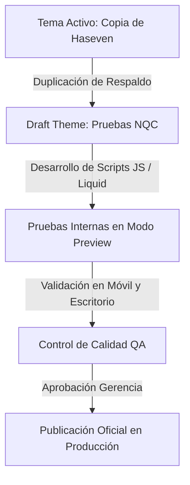

# PLAN DE TRABAJO DETALLADO Y CRONOGRAMA DE EJECUCIÓN — MES 2 (SEMANAS 5 A 8)
## IMPLEMENTACIÓN DE QUICK WINS, MÓDULO DE RASTREO EN WIX Y CÁLCULO DINÁMICO DE PRECIOS EN SHOPIFY
### Proyecto de Prácticas Empresariales | Detalgraf S.A.S. & DetalShop.com

**Para:** Gerencia General, Dirección de Operaciones y Jefatura Comercial  
**Empresa:** Detalgraf S.A.S.  
**Plataformas:** Detalgraf.com (Wix B2B) & DetalShop.com (Shopify E-commerce)  
**Elaborado por:** Nicolas Quintero Cardona (Practicante de Ingeniería / Líder de Transformación Digital & UX)  
**Periodo del Mes 2:** Semanas 5 a 8 (21 de Septiembre de 2026 – 18 de Octubre de 2026)  
**Dedicación:** ~160 Horas Laborales (40 horas semanales / 9 horas diarias)  
**Entorno de Trabajo Seguro:** Tema Shopify `Pruebas NQC` (Versión 3.0.2) y Entorno Sandbox Wix Studio  

---

## 📑 ÍNDICE GENERAL DEL DOCUMENTO

1. [Resumen Ejecutivo y Objetivos del Mes 2](#1-resumen-ejecutivo-y-objetivos-del-mes-2)
2. [Estrategia y Metodología de Implementación Segura](#2-estrategia-y-metodología-de-implementación-segura)
   - 2.1. Aislamiento en Shopify: Uso exclusivo del tema borrador `Pruebas NQC`
   - 2.2. Aislamiento en Wix: Entorno Velo y páginas de prueba
   - 2.3. Protocolo de Despliegue y Rollback
3. [Cronograma Detallado Semana a Semana (Semanas 5 a 8)](#3-cronograma-detallado-semana-a-semana-semanas-5-a-8)
   - 3.1. Semana 5 (21/09 – 27/09): Diagnóstico Técnico, Arquitectura y Maquetación de `/tracking` en Wix
   - 3.2. Semana 6 (28/09 – 04/10): Lógica Funcional de Tracking (Velo JS), Estados de Envío y Enrutamiento a WhatsApp
   - 3.3. Semana 7 (05/10 – 11/10): Desarrollo del Cálculo Dinámico de Precios en Vivo (Shopify Liquid & JS)
   - 3.4. Semana 8 (12/10 – 18/10): Limpieza de Widgets, Validación Cédula/NIT en Carrito, Auditoría QA y Pase a Producción
4. [Especificación Técnica de los Desarrollos](#4-especificación-técnica-de-los-desarrollos)
   - 4.1. Módulo `/tracking` en Wix (Detalgraf.com)
   - 4.2. Motor de Cálculo Dinámico en Shopify (DetalShop.com)
   - 4.3. Validación de Identificación Tributaria (Cédula/NIT)
5. [Matriz de Riesgos y Plan de Mitigación](#5-matriz-de-riesgos-y-plan-de-mitigación)
6. [Métricas de Control y Criterios de Aceptación (KPIs Mes 2)](#6-métricas-de-control-y-criterios-de-aceptación-kpis-mes-2)

---

## 1. RESUMEN EJECUTIVO Y OBJETIVOS DEL MES 2

Finalizado y aprobado con honores el **Mes 1** (Investigación UX, Benchmark, Design Tokens, Wireframes y Prototipo Hi-Fi validado con puntaje SUS de **87.5/100**), el proyecto ingresa a su **Mes 2: Fase de Implementación Técnica de "Quick Wins"**.

El propósito del Mes 2 es trasladar los diseños y prototipos aprobados en Figma al **código real de producción**, atacando los dos puntos de mayor fricción operativa y de conversión sin afectar las ventas diarias de la empresa:

```
┌────────────────────────────────────────────────────────────────────────────────────────┐
│                        HOJA DE RUTA MES 2: DE FIGMA AL CÓDIGO                          │
├───────────────────────────────────────────┬────────────────────────────────────────────┤
│ 1. PORTAL B2B WIX (Detalgraf.com)         │ 2. E-COMMERCE SHOPIFY (DetalShop.com)      │
├───────────────────────────────────────────┼────────────────────────────────────────────┤
│ • Reparación integral de `/tracking`      │ • Cálculo de precio en vivo en la PDP      │
│ • Búsqueda limpia por Guía / Factura      │   (Precio Unitario × Cantidad = Subtotal)  │
│ • Visualizador de estados logísticos      │ • Depuración de widgets conflictivos       │
│ • Derivación asistida por WhatsApp        │ • Validación de campo Cédula / NIT         │
└───────────────────────────────────────────┴────────────────────────────────────────────┘
```

### Objetivos Clave del Mes:
1. **Erradicar la pantalla en blanco en la sección `/tracking` de Wix:** Ofrecer un buscador intuitivo que permita a clientes corporativos consultar el estado de despacho y, en caso de guías no encontradas o incidencias, derivarlos automáticamente con su número de orden al WhatsApp de atención al cliente.
2. **Eliminar la incertidumbre de precio por cantidad en Shopify:** Garantizar que en la Ficha de Producto (PDP), cuando el comprador modifique la cantidad (ej. de 1 a 12 unidades), el total acumulado se actualice al milisegundo en pantalla sin requerir recargar la página ni navegar al carrito.
3. **Limpieza visual y optimización de checkout:** Desactivar extensiones redundantes y añadir la captura de Cédula/NIT para facturación electrónica reglamentaria en Colombia.

---

## 2. ESTRATEGIA Y METODOLOGÍA DE IMPLEMENTACIÓN SEGURA

Uno de los pilares de la metodología de prácticas es garantizar **cero interrupción comercial** y **cero riesgo de caída de la tienda**. Por ello, todas las intervenciones se realizarán bajo un estricto protocolo de aislamiento:

### 2.1. Aislamiento en Shopify (Tema Borrador `Pruebas NQC`)
* **Estado Actual:** La tienda en vivo opera bajo el tema activo `Copia de Haseven | Detalshop` (Versión 3.0.2).
* **Entorno de Trabajo:** Se ha habilitado la copia de desarrollo denominada **`Pruebas NQC` (Versión 3.0.2)** en la sección de *Draft Themes*.
* **Regla de Oro:** **Ningún cambio de código se efectuará directamente sobre el tema activo**. Todo script, modificación de plantillas Liquid, CSS y lógica JavaScript se implementará, probará y validará en `Pruebas NQC`. Solo tras recibir visto bueno gerencial y superar el checklist de pruebas, se publicará o sincronizará con producción.



### 2.2. Aislamiento en Wix (Detalgraf.com)
* Se trabajará en modo borrador dentro de Wix Studio / Wix Velo.
* Se creará una página de prueba (sandbox) para el módulo de tracking antes de reescribir la ruta oficial `/tracking`.
* Se mantendrán copias de seguridad del sitio en el historial de versiones de Wix (*Site History*).

### 2.3. Protocolo de Rollback (Plan de Retorno Inmediato)
* En caso de cualquier anomalía imprevista en Shopify, volver a la versión anterior requiere un solo clic manteniendo activo el tema de respaldo intacto.
* En Wix, el restaurador de versiones permite regresar al estado previo en menos de 60 segundos.

---

## 3. CRONOGRAMA DETALLADO SEMANA A SEMANA (SEMANAS 5 A 8)

El Mes 2 comprende un total de **4 semanas de ejecución técnica intensiva (~160 horas)**:

```
┌────────────────────────────────────────────────────────────────────────────────────────┐
│                        CRONOGRAMA DE EJECUCIÓN SEMANAL — MES 2                         │
├───────────────────┬───────────────────┬────────────────────────┬───────────────────────┤
│ SEMANA 5          │ SEMANA 6          │ SEMANA 7               │ SEMANA 8              │
│ (21/09 - 27/09)   │ (28/09 - 04/10)   │ (05/10 - 11/10)        │ (12/10 - 18/10)       │
├───────────────────┼───────────────────┼────────────────────────┼───────────────────────┤
│ Setup & Tracking  │ Lógica Velo Wix & │ Precio Dinámico        │ Limpieza, Cédula/NIT, │
│ Maquetación Base  │ Estados Logísticos│ Shopify Liquid / JS    │ QA & Despliegue       │
├───────────────────┼───────────────────┼────────────────────────┼───────────────────────┤
│ • Setup Pruebas   │ • Código Velo JS  │ • Script Liquid / JS   │ • Desactivar widgets  │
│   NQC en Shopify  │ • Simulación de   │   en tema Pruebas NQC  │   obsoletos           │
│ • Diagnóstico Wix │   estados (1 al 4)│ • Multiplicador en vivo│ • Validación NIT en   │
│   en /tracking    │ • Enlace WhatsApp │   (Precio × Cantidad)  │   carrito             │
│ • Maquetación UI  │   con prellenado  │ • Formato moneda COP   │ • Pruebas responsive  │
│   según Figma     │ • Validaciones UI │ • Gestión de variantes │ • Publicación oficial │
└───────────────────┴───────────────────┴────────────────────────┴───────────────────────┘
```

---

### 3.1. SEMANA 5: Diagnóstico Técnico, Arquitectura y Maquetación de `/tracking` en Wix
* **Periodo:** Lunes 21 de Septiembre a Domingo 27 de Septiembre de 2026.
* **Dedicación:** 40 Horas Laborales.
* **Objetivo de la Semana:** Realizar la auditoría de acceso al portal Wix y la tienda Shopify `Pruebas NQC`, establecer los archivos base y maquetar la interfaz visual de `/tracking` en Wix respetando al 100% los tokens de diseño definidos en Figma durante el Mes 1.

#### Actividades Paso a Paso:
1. **Día 1 (21/09): Inspección y Configuración de Accesos:**
   - Verificación de permisos en Shopify Admin (`admin.shopify.com/store/detalgraf`).
   - Confirmación de integridad del tema borrador `Pruebas NQC` (v3.0.2).
   - Acceso al panel de control de Wix (Detalgraf.com) y activación de herramientas para desarrolladores (Wix Studio / Velo Code).
   - Respaldo formal (*Snapshot*) del historial de versiones en ambas plataformas.
2. **Día 2 (22/09): Diagnóstico Profundo del Fallo de `/tracking` en Wix:**
   - Análisis de por qué la página actual de tracking carga en blanco (conflicto de scripts obsoletos, iframe bloqueado o ausencia de componente renderizador).
   - Levantamiento de requisitos de campos necesarios: Número de Guía Nacional, Número de Factura de Venta Detalgraf y Cédula/NIT del comprador.
3. **Día 3 (23/09): Maquetación Estructural de la Pantalla de Búsqueda (Wix):**
   - Creación del contenedor hero centrado con tipografía institucional (*Inter / Outfit*).
   - Incorporación del título: *"Rastreo y Seguimiento de tu Envío"*.
   - Inserción de la caja de búsqueda interactiva: Input de texto `[ Ingrese su número de guía o factura ]` y botón de acción primario `[ Rastrear Envío ]` con color azul institucional (`#1A4B8C`).
4. **Día 4 (24/09): Maquetación del Contenedor de Resultados (Timeline Visual):**
   - Construcción del componente de estados con 4 etapas gráficas:
     - 1. *Orden Confirmada / Facturada*
     - 2. *En Alistamiento en Bodega*
     - 3. *En Tránsito con Transportadora*
     - 4. *Entregado con Éxito*
   - Maquetación de la tarjeta resumen (Transportadora asignada, fecha estimada de llegada, destino).
5. **Día 5 (25/09): Maquetación de la Caja de Asistencia Alternativa:**
   - Inclusión de la sección de contingencia: *"¿No encuentras tu número de guía o tienes dudas con tu despacho?"*.
   - Botón directo con icono oficial de WhatsApp: `[ Consultar con un Asesor por WhatsApp ]`.
6. **Fin de Semana (26/09 – 27/09):** Revisión de consistencia visual frente al Prototipo Hi-Fi de Figma y pruebas de renderizado en resolución móvil (390px) y escritorio (1440px).

**Entregables Semana 5:**
* Entorno de pruebas `Pruebas NQC` listo en Shopify.
* Nueva interfaz de `/tracking` maquetada en borrador de Wix, limpia y responsive, libre de pantallas en blanco.

---

### 3.2. SEMANA 6: Lógica Funcional de Tracking (Velo JS), Estados de Envío y WhatsApp
* **Periodo:** Lunes 28 de Septiembre a Domingo 04 de Octubre de 2026.
* **Dedicación:** 40 Horas Laborales.
* **Objetivo de la Semana:** Programar la lógica interactiva en Velo (JavaScript de Wix) para procesar las búsquedas de guía, mostrar las tarjetas de estado correspondientes y generar el enlace dinámico a WhatsApp prellenando los datos del cliente.

#### Actividades Paso a Paso:
1. **Día 1 (28/09): Configuración de Base de Datos y Colección en Wix:**
   - Creación de una colección de datos en Wix (*Orders_Tracking*) para pruebas de consulta local (Campos: `guiaNumber`, `customerName`, `status`, `carrier`, `estimatedDate`, `destination`).
   - Configuración de permisos de lectura pública (*Everyone can read*).
2. **Día 2 (29/09): Programación del Controlador Velo (`$w.onReady`):**
   - Programación de evento `onClick` del botón `[ Rastrear Envío ]` y evento `onKeyPress` (captura de tecla *Enter* en el input).
   - Sanitización del valor de entrada: eliminación de espacios en blanco, conversión a mayúsculas y validación de longitud mínima (evitar consultas vacías).
3. **Día 3 (30/09): Renderizado Dinámico de Estados y Animación del Timeline:**
   - Lógica de activación de pasos: según el estado retornado (`CONFIRMADO`, `PREPARACION`, `TRANSITO`, `ENTREGADO`), iluminar con color verde esmeralda (`#00A86B`) los círculos e indicadores correspondientes de la línea de tiempo.
   - Manejo del estado "No Encontrado": Si la guía no existe en el sistema, mostrar alerta visual amigable: *"No encontramos un despacho activo con el número ingresado. Por favor verifica tus datos o contacta a soporte directo"*.
4. **Día 4 (01/10): Enrutamiento Automatizado a WhatsApp con Mensaje Prellenado:**
   - Programación del enlace de escape a WhatsApp Business utilizando la API universal `wa.me`:
     ```javascript
     // Generación de URL codificada:
     const phone = "573XXXXXXXXX"; // Línea comercial Detalgraf
     const msg = encodeURIComponent(`Hola Detalgraf, requiero soporte con el estado de mi envío. Mi número de guía/factura es: ${inputGuia}`);
     const whatsappUrl = `https://wa.me/${phone}?text=${msg}`;
     ```
   - Asignación dinámica de `whatsappUrl` al botón de asistencia.
5. **Día 5 (02/10): Pruebas de Estrés y Validación con el Equipo de Operaciones:**
   - Ejecución de 15 búsquedas de prueba con guías válidas, guías inexistentes y caracteres especiales.
   - Validación de tiempos de respuesta (< 500 ms).
6. **Fin de Semana (03/10 – 04/10):** Consolidación de documentación de código de Wix Velo y preparación del paquete de trabajo de Shopify para la Semana 7.

**Entregables Semana 6:**
* Módulo `/tracking` 100% funcional en Wix, capaz de consultar órdenes y derivar casos especiales a WhatsApp con mensaje automático.

---

### 3.3. SEMANA 7: Desarrollo del Cálculo Dinámico de Precios en Vivo (Shopify Liquid & JS)
* **Periodo:** Lunes 05 de Octubre a Domingo 11 de Octubre de 2026.
* **Dedicación:** 40 Horas Laborales.
* **Objetivo de la Semana:** Desarrollar e integrar el script de cálculo dinámico de precio en la Ficha de Producto (PDP) dentro del tema borrador `Pruebas NQC` en Shopify, garantizando reactividad instantánea al cambiar cantidades o variantes.

#### Actividades Paso a Paso:
1. **Día 1 (05/10): Auditoría del Código de la Ficha de Producto (`main-product.liquid`):**
   - Inspección del tema `Pruebas NQC` (Versión 3.0.2).
   - Identificación de los selectores DOM del precio (`price`, `price__regular`, `price-item--regular`), del input de cantidad (`quantity__input`) y de los botones stepper (`quantity__button[name="plus"]` / `[name="minus"]`).
2. **Día 2 (06/10): Arquitectura del Snippet `dynamic-pricing.liquid`:**
   - Creación de un snippet modular e independiente en la carpeta `snippets/` del tema `Pruebas NQC` para no alterar el archivo central de Shopify de forma destructiva.
   - Extracción segura del precio unitario base mediante Liquid (`{{ product.selected_or_first_available_variant.price }}`).
   - Formateo de moneda colombiana con separador de miles (`Intl.NumberFormat('es-CO')` o filtro Liquid `money_with_currency`).
3. **Día 3 (07/10): Programación de la Lógica Reactiva en JavaScript Vanilla:**
   - Escucha de eventos `input` y `change` sobre el campo de cantidad.
   - Escucha de eventos `click` en los botones de suma `+` y resta `-`.
   - Cálculo en vivo:
     $$\text{Subtotal Estimado} = \text{Precio Unitario de Variante} \times \text{Cantidad Seleccionada}$$
   - Renderizado en pantalla: inserción de un elemento con micro-copia clara justo debajo del precio o junto al botón de compra:
     `Total a pagar por este ítem: $ 180.000 COP` (calculado al instante para 3 garrafas de $60.000).
4. **Día 4 (08/10): Soporte para Cambio de Variantes de Producto:**
   - Integración con el evento de cambio de variante nativo del tema de Shopify (`variant:change` o mutación del selector de variantes de Haseven).
   - Al cambiar de tamaño o presentación (ej. Galón 5L ➔ Garrafa 20L), el script recalcula el subtotal inmediatamente tomando el nuevo precio base de la variante elegida.
5. **Día 5 (09/10): Optimización Visual y Micro-Animaciones:**
   - Incorporación de una suave transición CSS (`fade-in` de 150ms) en la actualización del número para que el cliente perciba fluidez sin saltos bruscos.
   - Verificación de compatibilidad con pantallas táctiles en dispositivos Android y iPhone.
6. **Fin de Semana (10/10 – 11/10):** Pruebas de compatibilidad con productos simples, productos con variantes y productos en descuento (*compare_at_price*).

**Entregables Semana 7:**
* Script de precio dinámico en tiempo real funcionando en la PDP del tema `Pruebas NQC` en Shopify sin fallos ni recargas de página.

---

### 3.4. SEMANA 8: Limpieza de Widgets, Validación Cédula/NIT, Auditoría QA y Pase a Producción
* **Periodo:** Lunes 12 de Octubre a Domingo 18 de Octubre de 2026.
* **Dedicación:** 40 Horas Laborales.
* **Objetivo de la Semana:** Desactivar extensiones y widgets innecesarios que ralentizan la tienda Shopify, incorporar la validación de Cédula/NIT en el carrito para clientes corporativos y consumidores finales, realizar la auditoría completa de calidad (QA) y desplegar oficialmente los Quick Wins del Mes 2 en producción.

#### Actividades Paso a Paso:
1. **Día 1 (12/10): Auditoría y Desactivación de Widgets Innecesarios:**
   - Identificación de aplicaciones de terceros (apps) instaladas en Shopify que insertan popups invasivos, banners flotantes o scripts pesados que compiten con el diseño institucional.
   - Desactivación controlada desde *Theme Customizer* (*App Embeds*) y desinstalación de scripts no utilizados en el tema `Pruebas NQC`.
   - Medición de la reducción en peso de página y peticiones HTTP.
2. **Día 2 (13/10): Integración del Campo Obligatorio de Cédula / NIT en Carrito:**
   - Implementación de un atributo de orden (*Cart Attribute*) en la vista de carrito (`cart-template.liquid` o `cart-drawer.liquid`):
     - Campo: `[ Número de Cédula o NIT para Facturación Electrónica ]`.
   - Programación de script de validación:
     - Detección de caracteres numéricos y guion de verificación.
     - Bloqueo de avance al checkout si el campo está vacío, mostrando un mensaje de alerta accesible: *"Requerido para la emisión de su factura legal DIAN"*.
3. **Día 3 (14/10): Pruebas Integrales de Calidad (QA) y Cross-Browser:**
   - Pruebas en Google Chrome, Safari, Mozilla Firefox y Microsoft Edge.
   - Pruebas de usabilidad en dispositivos reales: iPhone (iOS Safari), Samsung/Xiaomi (Chrome Mobile).
   - Verificación de que el flujo de pago en Shopify (`/checkout`) procese correctamente el atributo de Cédula/NIT en los detalles de la orden para el equipo de contabilidad.
4. **Día 4 (15/10): Auditoría de Rendimiento Lighthouse & SEO:**
   - Ejecución de auditoría Google Lighthouse comparativa en `Pruebas NQC` frente al tema activo:
     - Rendimiento móvil esperado: > 75/100.
     - Buenas Prácticas y Accesibilidad: > 90/100.
   - Corrección de alertas de contraste y atributos alt en imágenes.
5. **Día 5 (16/10): Pase Oficial a Producción y Publicación:**
   - Visto bueno final de Gerencia General y Jefatura Comercial.
   - Publicación del tema `Pruebas NQC` como tema activo en Shopify (o actualización sincronizada del tema principal).
   - Publicación oficial de la nueva página `/tracking` en Detalgraf.com (Wix).
6. **Fin de Semana (17/10 – 18/10):** Monitoreo en vivo de las primeras órdenes y consultas de rastreo durante las primeras 48 horas de producción. Elaboración del informe de cierre del Mes 2.

**Entregables Semana 8:**
* Tema `Pruebas NQC` optimizado y publicado exitosamente en producción.
* Módulo `/tracking` activo en Detalgraf.com.
* Ficha de producto con precio en tiempo real y carrito con captura de Cédula/NIT operativos.
* Informe final de cierre del Mes 2 y puente al Mes 3.

---

## 4. ESPECIFICACIÓN TÉCNICA DE LOS DESARROLLOS

### 4.1. Módulo `/tracking` en Wix (Detalgraf.com)
* **Pila Tecnológica:** Wix Studio, Velo JS (`$w`), Wix Data API (`wix-data`), Web Linking API.
* **Estructura de Componentes Visuales:**
  - `#inputGuia`: Input tipo texto estilizado con radio de borde de 8px y borde `#D9D9D9`.
  - `#btnRastrear`: Botón interactivo primario con color `#1A4B8C` y texto en blanco bold.
  - `#boxResultado`: Contenedor oculto por defecto que se anima con `fade` al obtener respuesta.
  - `#timelineSteps`: 4 cajas vectoriales con icono de check y texto de estado.
  - `#btnWhatsappHelp`: Enlace directo a `https://wa.me/573...` con mensaje codificado en URL.

### 4.2. Motor de Cálculo Dinámico en Shopify (DetalShop.com)
* **Ubicación:** `snippets/dynamic-product-price.liquid` incorporado en `sections/main-product.liquid`.
* **Lógica en Vanilla JavaScript:**
  ```javascript
  // dynamic-product-price.js
  document.addEventListener('DOMContentLoaded', () => {
    const qtyInput = document.querySelector('input[name="quantity"]');
    const priceDisplay = document.querySelector('.price-item--regular') || document.querySelector('.price');
    const subtotalContainer = document.querySelector('#dynamic-subtotal-display');
    
    if (!qtyInput || !subtotalContainer) return;
    
    function updateSubtotal() {
      const unitPrice = parseFloat(subtotalContainer.dataset.unitPrice) / 100; // En pesos
      const quantity = parseInt(qtyInput.value, 10) || 1;
      const subtotal = unitPrice * quantity;
      
      const formatted = new Intl.NumberFormat('es-CO', {
        style: 'currency',
        currency: 'COP',
        maximumFractionDigits: 0
      }).format(subtotal);
      
      subtotalContainer.innerHTML = `<strong>Total estimado (${quantity} unds):</strong> <span class="highlight-price">${formatted} COP</span>`;
    }
    
    qtyInput.addEventListener('input', updateSubtotal);
    document.querySelectorAll('.quantity__button').forEach(btn => {
      btn.addEventListener('click', () => setTimeout(updateSubtotal, 50));
    });
  });
  ```

### 4.3. Validación de Cédula / NIT en Carrito
* **Ubicación:** `templates/cart.liquid` / `sections/cart-drawer.liquid`.
* **Atributo en Liquid:**
  ```html
  <div class="cart__tax-id-field" style="margin: 15px 0;">
    <label for="CartTaxId" style="display:block; font-weight:600; margin-bottom:5px;">
      Cédula o NIT (Requerido para Facturación Electrónica DIAN) *
    </label>
    <input type="text" id="CartTaxId" name="attributes[Cedula_o_NIT]" 
           value="{{ cart.attributes.Cedula_o_NIT }}" 
           placeholder="Ej: 900.123.456-7 o 1.020.304.050" 
           required class="field__input" style="width: 100%; padding: 10px; border: 1px solid #ccc; border-radius: 6px;">
    <span id="tax-id-error" style="color: #D9534F; display: none; font-size: 13px; margin-top: 4px;">
      Por favor ingresa tu identificación para procesar la factura electrónica.
    </span>
  </div>
  ```

---

## 5. MATRIZ DE RIESGOS Y PLAN DE MITIGACIÓN

| Riesgo Técnico / Operativo | Probabilidad | Impacto | Estrategia de Mitigación |
| :--- | :---: | :---: | :--- |
| **Interrupción de ventas en la tienda activa** | Muy Baja | Crítico | **Uso 100% aislado del tema borrador `Pruebas NQC`**. No se toca el tema activo hasta completar la fase QA. |
| **Incompatibilidad de JavaScript con versiones móviles antiguas** | Baja | Medio | Uso de JavaScript estándar ECMAScript 6 Vanilla sin librerías pesadas y con pruebas en navegadores móviles. |
| **Búsquedas de guías no registradas en Wix** | Media | Bajo | Mensaje visual amigable y derivación en 1 clic a WhatsApp con mensaje prellenado para atención humana inmediata. |
| **Conflicto de estilos CSS con clases existentes** | Baja | Medio | Uso de prefijos CSS únicos (`.nqc-dynamic-price`, `.nqc-tracking-container`) para evitar colisiones con el tema Haseven. |

---

## 6. MÉTRICAS DE CONTROL Y CRITERIOS DE ACEPTACIÓN (KPIS MES 2)

Al culminar la Semana 8, se auditará el cumplimiento estricto de los siguientes criterios:

1. **Cálculo Dinámico PDP:** 100% de los productos de DetalShop actualizan el subtotal en vivo al cambiar la cantidad en menos de 50 milisegundos.
2. **Autogestión de Tracking:** Eliminación total de pantallas en blanco en `/tracking` de Detalgraf.com; 100% de las consultas no reconocidas redirigen a WhatsApp con número de guía prellenado.
3. **Calidad y Rendimiento:** La puntuación en Google Lighthouse del tema `Pruebas NQC` debe igualar o superar la del tema activo actual.
4. **Cumplimiento de Plazos:** 100% de las tareas de las Semanas 5, 6, 7 y 8 ejecutadas dentro de las ~160 horas asignadas al Mes 2.

---

**Documentos de Referencia:**
* [Matriz Cronograma Semanal 5 Meses](file:///c:/Users/Nicolas/OneDrive/Escritorio/Trabajo/01_Plan_de_Trabajo/MATRIZ_CRONOGRAMA_SEMANAL_5_MESES.md)
* [Propuesta Plan de Trabajo 5 Meses](file:///c:/Users/Nicolas/OneDrive/Escritorio/Trabajo/01_Plan_de_Trabajo/PROPUESTA_PLAN_DE_TRABAJO_5_MESES.md)
* [Informe de Prototipado Hi-Fi y Usabilidad — Semana 4](file:///c:/Users/Nicolas/OneDrive/Escritorio/Trabajo/03_Informes_Semanales/INFORME_PROTOTIPADO_HIFI_Y_USABILIDAD_SEMANA_4.md)
* [Sistema de Medición y Tablero de KPIs](file:///c:/Users/Nicolas/OneDrive/Escritorio/Trabajo/04_Metricas_y_KPIs/SISTEMA_DE_MEDICION_ESTADISTICAS_Y_DASHBOARD_KPIS.md)
