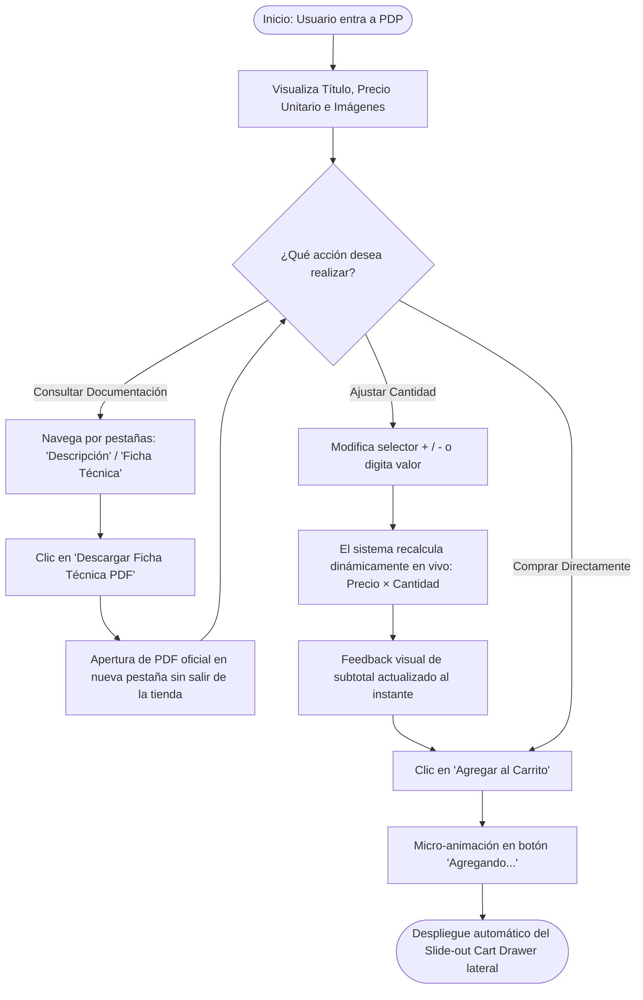
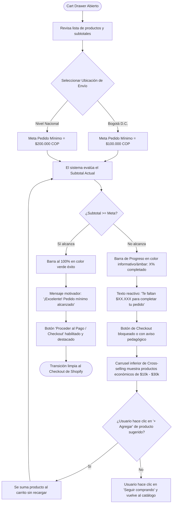
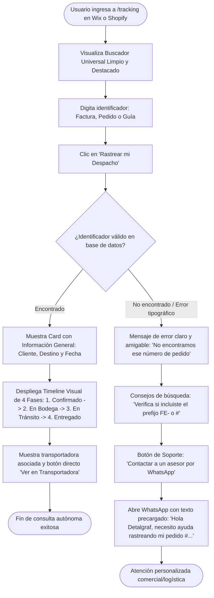

# INFORME DE ESTRATEGIA UX, INSIGHTS Y DIRECCIÓN DE PRODUCTO — SEMANA 2
## Proyecto de Prácticas Empresariales | Detalgraf S.A.S. & DetalShop.com

**Fecha:** Semana 2 (31/08/2026 – 04/09/2026)  
**Elaborado por:** Nicolas Quintero Cardona  
**Objetivo:** Consolidar los hallazgos de investigación, redefinir los problemas centrales bajo metodologías UX (POV / HMW), identificar oportunidades de diseño y establecer la dirección estratégica del producto antes de la diagramación de flujos y prototipado.

---

## 1. INSIGHTS CLAROS DE INVESTIGACIÓN (B2B & B2C)

A partir de la auditoría heurística, el análisis del comportamiento comercial y las entrevistas internas con el equipo de ventas, se consolidan los siguientes **insights clave**:

### 🏢 Insights del Canal Corporativo B2B (Detalgraf - Wix)
1. **La Ficha Técnica PDF es un disparador de venta, no un accesorio:**  
   Los jefes de compras y auditores de calidad no compran por impulso visual; requieren validar gramajes, composiciones químicas y certificaciones oficiales en PDF antes de solicitar una cotización formal.
2. **La incertidumbre en `/tracking` satura el canal comercial:**  
   Cuando un comprador corporativo no encuentra dónde rastrear su despacho en la web, recurre inmediatamente a llamadas o mensajes de WhatsApp al asesor, interrumpiendo labores de prospección y cierre de nuevos negocios.
3. **Multiplicidad de identificadores:**  
   El cliente corporativo busca por su número de **Factura Electrónica** o **NIT**, no por un número de guía de transportadora que a menudo desconoce.

### 🛒 Insights del Canal E-commerce B2C (DetalShop - Shopify)
1. **Cálculo mental forzado = Abandono de compra:**  
   Al modificar cantidades en la Ficha de Producto (PDP), el usuario se ve obligado a multiplicar mentalmente el precio unitario. La falta de feedback inmediato genera dudas y frena la intención de compra.
2. **El "Shock del Checkout" por Pedido Mínimo:**  
   Descubrir hasta el último paso del checkout que no se cumple el pedido mínimo ($100.000 en Bogotá o $200.000 a Nivel Nacional) genera frustración y sensación de pérdida de tiempo, provocando el abandono definitivo del carrito.
3. **Falta de opciones de adición rápida (Cross-selling):**  
   Cuando al usuario le faltan $15.000 o $30.000 para completar el monto mínimo, no tiene productos sugeridos a la mano dentro del carrito y prefiere marcharse antes que volver a navegar todo el catálogo.

---

## 2. PROBLEMA REDEFINIDO Y VALIDADO (Framework POV & HMW)

### 📌 Declaraciones de Punto de Vista (POV - Point of View)

* **POV 1 (Comprador B2C - DetalShop):**  
  *El comprador de hogar o pequeños negocios* **necesita** saber cuánto lleva acumulado en tiempo real y cuánto le falta exactamente para cumplir el pedido mínimo **porque** enterarse de las restricciones al final del checkout le genera desconfianza y abandono.

* **POV 2 (Comprador Corporativo B2B - Detalgraf):**  
  *El jefe de compras o auxiliar administrativo* **necesita** acceder de inmediato a fichas técnicas oficiales y consultar el estado de sus pedidos con su número de factura o NIT **porque** tiene tiempos de auditoría estrictos y necesita autonomía sin depender de llamadas al asesor.

---

### ❓ Preguntas Generadoras de Solución (HMW - How Might We / ¿Cómo Podríamos?)

| Área Focal | Pregunta Clave (HMW) | Enfoque de Solución |
| :--- | :--- | :--- |
| **Ficha de Producto (PDP)** | *¿Cómo podríamos mostrar el costo total acumulado al instante y facilitar la lectura de especificaciones técnicas?* | Calculador dinámico en vivo (`Precio × Cantidad`) + Pestañas modulares (*Descripción / Especificaciones / Ficha Técnica PDF*). |
| **Carrito de Compras** | *¿Cómo podríamos motivar al usuario a alcanzar el pedido mínimo de forma transparente y sin fricción?* | *Slide-out Cart Drawer* lateral con barra de progreso reactiva ($100k / $200k) y productos complementarios en 1 clic. |
| **Rastreo (`/tracking`)** | *¿Cómo podríamos brindar trazabilidad autónoma al cliente y descongestionar el WhatsApp del equipo comercial?* | Buscador universal limpio (Factura, Pedido, Guía) con estados visuales claros y botón de ayuda pre-cargado. |

---

## 3. OPORTUNIDADES DE DISEÑO IDENTIFICADAS

```
                    ┌───────────────────────────────────────────────┐
                    │      OPORTUNIDADES DE DISEÑO UX/UI            │
                    └───────────────────────────────────────────────┘
                                           │
         ┌─────────────────────────────────┼────────────────────────────────┐
         ▼                                 ▼                                ▼
┌──────────────────┐             ┌───────────────────┐            ┌───────────────────┐
│ 1. PDP Dinámica  │             │ 2. Smart Drawer   │            │ 3. Universal      │
│    & Modular     │             │    Cart con Meta  │            │    Tracking       │
├──────────────────┤             ├───────────────────┤            ├───────────────────┤
│• Subtotal en vivo│             │• Barra $100k/$200k│            │• Caja de búsqueda │
│• Tabs para PDF   │             │• Selector destino │            │  limpia y visible │
│• Botón de compra │             │• Cross-selling de │            │• Timeline claro   │
│  siempre visible │             │  1 clic para saldo│            │• WhatsApp asistido│
└──────────────────┘             └───────────────────┘            └───────────────────┘
```

1. **Oportunidad 1: Ficha de Producto Dinámica y Modular (PDP)**
   - Actualización visual instantánea del subtotal al interactuar con el selector de cantidad (`+ / -`).
   - Módulo organizado de 3 pestañas: *Descripción Comercial*, *Especificaciones en Pantalla* y *Descarga Oficial de Ficha Técnica PDF*.

2. **Oportunidad 2: Carrito Lateral Inteligente (*Slide-out Cart Drawer*)**
   - Panel lateral deslizante que evita recargas de página completas.
   - Barra de progreso reactiva con selector de destino (*Bogotá: Meta $100k* | *Nacional: Meta $200k*).
   - Mensajes dinámicos motivadores: *"¡Excelente! Ya tienes envío habilitado"* o *"Te faltan $25.000 COP para completar tu pedido"*.
   - Carrusel inferior de adición rápida (*Cross-selling*) con productos económicos para completar el saldo faltante.

3. **Oportunidad 3: Portal de Rastreo Universal (`/tracking`)**
   - Interfaz limpia con buscador prominente que acepta tanto `# de Pedido / Factura` como `# de Guía`.
   - Timeline visual de 4 etapas comprensibles sin tecnicismos logísticos.
   - Enlace directo a WhatsApp con mensaje contextualizado para soporte prioritario.

---

## 4. DIRECCIÓN ESTRATÉGICA DEL PRODUCTO (DESIGN PRINCIPLES)

Para el diseño de los prototipos en Figma (Semana 3 y 4) y posterior implementación en código (Meses 2 y 3), se establecen los siguientes **4 Principios de Diseño**:

1. **Transparencia Radical:** Ninguna condición de compra (pedido mínimo, costos de envío o tiempos de entrega) debe estar oculta o descubrirse al final del flujo.
2. **Eficiencia Cognitiva (Cero fricción de cálculo):** La interfaz debe realizar todas las operaciones matemáticas en tiempo real (subtotales por volumen, dinero faltante para pedido mínimo).
3. **Autonomía B2B:** Facilitar a los clientes corporativos la autosuficiencia en la descarga de documentación técnica y consulta de pedidos.
4. **Continuidad Visual (Design System Unificado):** Ambos portales (Wix y Shopify) deben compartir una identidad visual coherente en tipografía (*Inter / Outfit*), paleta de colores HSL corporativa y micro-interacciones.

---

## 5. USER FLOWS DETALLADOS: PDP, CART DRAWER Y /TRACKING

A continuación se definen los 3 flujos de usuario (*User Flows*) estructurados paso a paso, con sus puntos de decisión, estados del sistema y diagramas de flujo completos:

---

### 🟢 Flow 1: Ficha de Producto (PDP) Dinámica y Modular (DetalShop & Detalgraf)
* **Objetivo del Usuario:** Conocer especificaciones, descargar ficha técnica PDF y configurar cantidades con feedback de precio inmediato antes de agregar al carrito.



* **Puntos Clave de Interacción:**
  1. **Feedback en tiempo real:** Cero cálculos manuales; el subtotal se actualiza a medida que el usuario incrementa las unidades.
  2. **Acceso directo a PDF:** Módulo de tabs que no recarga la página ni interrumpe la navegación.
  3. **Transición fluida:** Al agregar producto, no se envía al usuario a una página `/cart` vacía o pesada, sino que se abre el panel lateral.

---

### 🛒 Flow 2: Smart Slide-out Cart Drawer con Barra de Pedido Mínimo ($100k / $200k)
* **Objetivo del Usuario:** Revisar su compra, saber con exactitud cuánto dinero le falta para habilitar el despacho y completar el saldo en 1 clic.



* **Puntos Clave de Interacción:**
  1. **Transparencia geográfica:** El switch `[Bogotá ($100k) | Nacional ($200k)]` ajusta la regla en el momento.
  2. **Cero frustración:** Se le da la solución inmediata al saldo faltante mediante productos complementarios (*Cross-sell* rápido).
  3. **Prevención de rebote:** El usuario no se entera de las restricciones cuando ya digitó sus datos de tarjeta en el checkout.

---

### 📦 Flow 3: Portal de Rastreo Universal (`/tracking`) con Soporte Asistido
* **Objetivo del Usuario:** Consultar el estado de despacho de su compra (B2B o B2C) con cualquier identificador disponible de forma autónoma.



* **Puntos Clave de Interacción:**
  1. **Flexibilidad en el input:** Acepta `# Pedido Shopify`, `Factura Electrónica B2B` o `Número de Guía de Transportadora`.
  2. **Lenguaje visual accesible:** Timeline claro sin tecnicismos logísticos confusos.
  3. **Plan de contingencia amigable:** Si no encuentra el registro, el fallback a WhatsApp está precargado con los datos para que el asesor resuelva rápido.

---

## 6. ESTADO DEL CRONOGRAMA — SEMANA 2

- [x] **1. Insights claros de investigación** *(Completado)*
- [x] **2. Problema redefinido y validado (POV / HMW)** *(Completado)*
- [x] **3. Oportunidades de diseño identificadas** *(Completado)*
- [x] **4. Dirección estratégica del producto** *(Completado)*
- [x] **5. User Flows PDP, Cart Drawer y `/tracking`** *(Completado y documentado con diagramas Mermaid)*

---
*Fin del documento de estrategia y flujos — Semana 2.*
