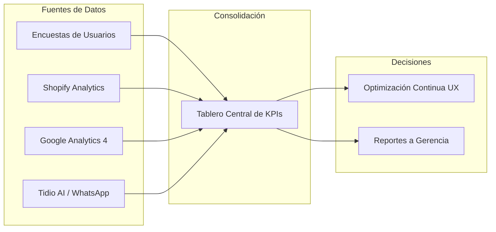

# SISTEMA DE MEDICIÓN, ESTADÍSTICAS Y TABLERO DE KPIS
## SEGUIMIENTO CUANTITATIVO Y EVALUACIÓN DE RESULTADOS (PROYECTO 5 MESES)

**Empresa:** Detalgraf S.A.S.  
**Plataformas:** Detalgraf.com (Wix B2B) y DetalShop.com (Shopify E-commerce)  
**Proyecto:** Plan de Trabajo de Prácticas Empresariales (5 Meses / ~800 Horas)  
**Responsable:** Nicolas Quintero Cardona  
**Última Actualización:** Agosto 2026 (Línea Base — Mes 1)

---

## 1. OBJETIVO DEL SISTEMA DE MEDICIÓN

El propósito de este documento es centralizar, consolidar y monitorear cuantitativamente el impacto y evolución del proyecto a lo largo de sus 5 meses de ejecución. Permite contrastar la **Línea Base inicial** (obtenida mediante auditorías, encuestas y analítica previa) frente a las metas de rendimiento tras implementar los entregables de Figma, Wix, Shopify y el Asistente de IA.

---

## 2. ESTRUCTURA DE KPIS Y MÉTRICAS CLAVE (SECCIÓN 6 DE LA PROPUESTA)

### 📈 A. Estadísticas del Asistente Virtual con IA (Chatbot B2B & Shopper)
* **Tasa de Resolución Autónoma (%):** Porcentaje de consultas de clientes/empresas resueltas directamente por la IA sin requerir intervención humana (catálogo, cobertura, políticas, descarga de PDFs).
* **Volumen de Leads B2B Generados:** Número de empresas registradas (NIT, Razón Social, volumen de compra) que solicitan cotización formal y se transfieren estructuradas al WhatsApp comercial.
* **Tiempo Promedio de Respuesta:** Reducción del tiempo de primera respuesta a consultas de catálogo de varias horas a **menos de 3 segundos** (atención 24/7).

### 🛒 B. Estadísticas de Conversión en Carrito y Pedidos Mínimos
* **Efectividad de la Barra de Pedido Mínimo:** Porcentaje de sesiones de compra que incrementaron el ticket para alcanzar los **$100.000 COP (Bogotá)** o **$200.000 COP (Nacional)** guiadas por el motivador visual del carrito lateral.
* **Tasa de Conversión de Cross-Selling:** Incremento de unidades por pedido gracias a la adición rápida en 1 clic de productos complementarios sugeridos en el pie del Slide-out Cart.
* **Tasa de Abandono de Carrito:** Porcentaje de reducción en carritos abandonados tras activar el cálculo dinámico de precio y el carrito lateral.

### 📄 C. Estadísticas de Uso de Fichas Técnicas y Rastreo
* **Métrica de Interacción y Descargas PDF:** Volumen de consultas y descargas directas de Fichas Técnicas PDF y Hojas de Seguridad (MSDS) por categoría.
* **Tasa de Autogestión en Rastreo (`/tracking`):** Porcentaje de clientes que consultan de forma autónoma el estado de su orden/guía en la web frente a los que congestionan el canal telefónico o chat.

---

## 3. LÍNEA BASE ACTUAL: RESULTADOS DE INVESTIGACIÓN DE CAMPO (MES 1)

### 🔵 Encuesta 1: DetalShop.com (E-commerce B2C)
* **Estado:** En recolección de respuestas.
* **Foco:** Validación de fricciones en pedido mínimo ($100k/$200k), claridad en cálculo de precios por volumen y percepción del proceso de checkout.
* *(Se actualizará con las métricas y porcentajes una vez finalice el periodo de respuesta).*

---

### 🟢 Encuesta 2: Detalgraf.com (Portal Corporativo B2B — 10 Respuestas Validadas)

| Métrica Evaluada | Dato Cuantitativo Obtenido | Hallazgo de Negocio | Impacto en la Propuesta |
| :--- | :---: | :--- | :--- |
| **Perfil de Comprador** | **100% Corporativo** (10/10) | Todos los compradores son empresas con NIT que requieren factura electrónica. | Justifica la orientación 100% B2B del portal Wix. |
| **Frecuencia de Compra** | **80% Mensual** 10% Semanal 10% Según necesidad | Alta recurrencia de pedidos institucionales programados. | Necesidad de agilizar la recompra y emisión de cotizaciones. |
| **Obligatoriedad de Fichas Técnicas PDF** | **80% Requerido** (40% Obligatorio + 40% por categoría) | La documentación técnica es filtro indispensable para autorizar compras y auditorías. | Valida el **Mes 3** (Módulo de Fichas Técnicas PDF en Metafields). |
| **Facilidad Actual de Hallar Fichas PDF** | **4.10 / 5.00** (50% califica 4, 30% 5, 20% 3) | Existe acceso pero un 20% presenta dificultades o tiempos muertos al buscar. | Optimizar la ubicación visual de descarga en 1 clic. |
| **Requisitos Previos a Orden de Compra** | **50%** Tiempos y Stock **20%** Registro Sanitario / MSDS **20%** Ficha dimensional/peso **10%** Descuento volumen | Disponibilidad inmediata y soporte normativo son los factores críticos de decisión. | Base de conocimiento para el Asistente IA (**Mes 4**) y fichas (**Mes 3**). |
| **Uso de Sección de Rastreo Web (`/tracking`)** | **80% NO la usa** (Prefiere WhatsApp) 20% La usa satisfactoriamente | La sección web actual no retiene al usuario; el 80% migra al canal manual de WhatsApp. | Valida el **Mes 2** (Reparación de la interfaz `/tracking` en Wix). |

#### 📝 Hallazgos Cualitativos B2B (Respuestas Abiertas de Clientes):
1. **Completitud de Catálogo Visual:** *"Las imágenes de los productos no se encuentran todas, sí se necesitan para ver qué se está comprando."* ➔ *(Se aborda en Mes 1 con auditoría visual y Figma).*
2. **Tiempos Administrativos y Documentales:** *"Tiempos de facturación"* y *"Entregar siempre con documentos solicitados por la empresa (remisión y orden de compra)"*.
3. **Calidad de Atención Comercial:** *"Excelente servicio. Su comercial Miryam es muy diligente y amable."* ➔ *(El Asistente IA del Mes 4 está diseñado para potenciar y no sustituir a la fuerza comercial, canalizando leads precalificados a su WhatsApp).*

---

## 4. MATRIZ DE SEGUIMIENTO: LÍNEA BASE VS. METAS PROYECTADAS

| Dimensión | Indicador Clave (KPI) | Línea Base (Mes 1) | Meta Proyectada (Mes 5) | Estado |
| :--- | :--- | :---: | :---: | :---: |
| **Portal B2B (Wix)** | Uso efectivo de autogestión en `/tracking` | **20%** (80% migra a WhatsApp) | **≥ 60%** autogestión en web | 🟡 En diseño Figma |
| **Portal B2B (Wix)** | Satisfacción en localización de Fichas PDF | **4.10 / 5.00** (20% regular) | **≥ 4.80 / 5.00** | 🟡 En maquetación |
| **E-commerce (Shopify)**| Cumplimiento de Pedidos Mínimos ($100k / $200k)| *Pendiente Encuesta 1* | **+20% a +35%** carritos conformes | ⏳ Pendiente B2C |
| **E-commerce (Shopify)**| Reducción de Abandono por Incertidumbre | *Medición inicial GA4* | **-15% a -25%** abandono | ⏳ Pendiente B2C |
| **Inteligencia Artificial**| Tiempo de atención inicial a prospectos B2B | Manual (Horas / Días) | **< 3 segundos** (24/7) | 🔵 Programado Mes 4 |
| **Inteligencia Artificial**| Entrega de leads estructurados a WhatsApp | 0% automatizado | **100%** de solicitudes con NIT y OC | 🔵 Programado Mes 4 |

---

## 5. PLAN DE ACTUALIZACIÓN DEL DOCUMENTO

Este informe se actualizará progresivamente siguiendo el roadmap de prácticas:
- **Hito 1 (Mes 1 - Cierre):** Integración de los resultados cuantitativos de la Encuesta 1 (DetalShop B2C) y métricas de navegación iniciales.
- **Hito 2 (Mes 2 - Quick Wins):** Primeras métricas de interacción con la nueva vista de `/tracking` en Wix y prueba de precios dinámicos.
- **Hito 3 (Mes 3 - Transaccional):** Estadísticas de descarga de Fichas PDF y efectividad de la barra de pedido mínimo en Shopify.
- **Hito 4 (Mes 4 - IA):** Reporte de volumen de conversaciones atendidas y leads derivados a WhatsApp por el bot.
- **Hito 5 (Mes 5 - Consolidación Final):** Tablero integrado en Looker Studio y entrega de la Memoria Final con retorno medido.
